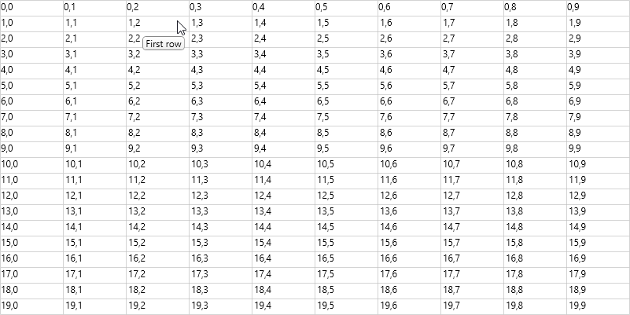
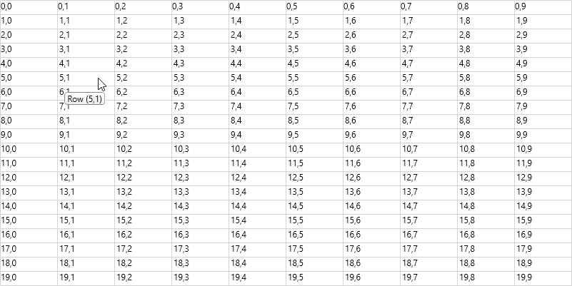
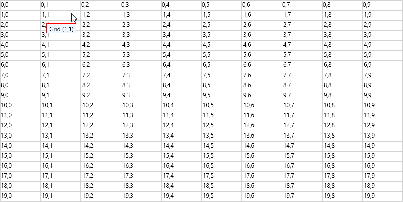

# WPF GridControl ToolTip

This repository contains the sample which shows add or remove the tooltip to a specific cell or row or column in [WPF GridControl](https://www.syncfusion.com/wpf-controls/excel-like-grid).

### ToolTip for row and column

ToolTip can be displayed for any row or column by setting the [ShowToolTip](https://help.syncfusion.com/cr/wpf/Syncfusion.Windows.Controls.Grid.GridStyleInfo.html#Syncfusion_Windows_Controls_Grid_GridStyleInfo_ShowTooltip) and ToolTip text can be customized by setting the [ToolTip](https://help.syncfusion.com/cr/wpf/Syncfusion.Windows.Controls.Grid.GridStyleInfo.html#Syncfusion_Windows_Controls_Grid_GridStyleInfo_ToolTip).

``` csharp
//Adding tooltip to the specific row
gridcontrol.Model.RowStyles[1].ToolTip = "First row";
gridcontrol.Model.RowStyles[1].ShowTooltip = true;

//Adding tooltip to the specific column
gridcontrol.Model.ColStyles[1].ToolTip = "First column";
gridcontrol.Model.ColStyles[1].ShowTooltip = true;
```



### Set ToolTip in QueryCellInfo event

You can set the ToolTip to a specific cell or row or column by using the [QueryCellInfo](https://help.syncfusion.com/cr/wpf/Syncfusion.Windows.Controls.Grid.GridControlBase.html#Syncfusion_Windows_Controls_Grid_GridControlBase_QueryCellInfo) event.

``` csharp
private void Gridcontrol_QueryCellInfo(object sender, GridQueryCellInfoEventArgs e)
{            
    e.Style.ShowTooltip = true;
    //Show tooltip for specific index
    if (e.Cell.RowIndex == 1 && e.Cell.ColumnIndex == 1)
        e.Style.ToolTip = " Grid (" + gridcontrol.Model[1, 1].CellValue +") ";
    // Show tooltip for row.
    if (e.Cell.ColumnIndex > 0 && e.Cell.RowIndex == 5)
        e.Style.ToolTip = " Row " + "(" + e.Cell.RowIndex + "," + e.Cell.ColumnIndex + ") ";
    // Show tooltip for column.
    if (e.Cell.RowIndex > 0 && e.Cell.ColumnIndex == 4)
        e.Style.ToolTip = " Column " + "(" + e.Cell.RowIndex + "," + e.Cell.ColumnIndex + ") ";
}
```



### Hide ToolTip for disabled cell

You can disable the cell by setting `Enabled` property to `false`. If you want to hide the tooltip for this disabled cell, you need to set the [ShowToolTip](https://help.syncfusion.com/cr/wpf/Syncfusion.Windows.Controls.Grid.GridStyleInfo.html#Syncfusion_Windows_Controls_Grid_GridStyleInfo_ShowTooltip) property to `false`.

``` csharp
gridcontrol.Model[1, 1].Enabled = false;
gridcontrol.Model[1, 1].ToolTip = " Grid (" + gridcontrol.Model[1, 1].CellValue + ") ";
gridcontrol.Model[1, 1].ShowTooltip = false;

//Using QueryCellInfo
private void Gridcontrol_QueryCellInfo(object sender, GridQueryCellInfoEventArgs e)
{
    if (e.Cell.RowIndex == 1 && e.Cell.ColumnIndex == 1)
    {
        e.Style.Enabled = false;
        e.Style.ToolTip = " Grid (" + e.Cell.RowIndex + "," + e.Cell.ColumnIndex + ") ";        
        e.Style.ShowTooltip = false;
    }
}
```

### Customize the ToolTip

The tooltip appearance can be customized by defining DataTemplate. The DataTemplate can be assigned to the [GridStyleInfo.ToolTipTemplateKey](https://help.syncfusion.com/cr/wpf/Syncfusion.Windows.Controls.Grid.GridStyleInfo.html#Syncfusion_Windows_Controls_Grid_GridStyleInfo_TooltipTemplateKey) or [GridStyleInfo.ToolTipTemplate](https://help.syncfusion.com/cr/wpf/Syncfusion.Windows.Controls.Grid.GridStyleInfo.html#Syncfusion_Windows_Controls_Grid_GridStyleInfo_TooltipTemplate) property. If you are using tooltipTemplate1 then you need to assign template to its corresponding template key property namely GridStyleInfo.ToolTipTemplate or GridStyleInfo.ToolTipTemplateKey.

[GridStyleInfo](https://help.syncfusion.com/cr/wpf/Syncfusion.Windows.Controls.Grid.GridStyleInfo.html) which holds cell information is the DataContext for data template of ToolTip.

#### Using ToolTipTemplateKey

##### XAML

``` xml
<Window.Resources>
    <DataTemplate x:Key="tooltipTemplate1">
        <Border Name="Border"
                Background="Green"
                BorderBrush="Black"
                BorderThickness="1" Width="60" Height="20"
                CornerRadius="0">
            <TextBlock Background="Transparent" Text="{Binding Path=ToolTip}" Padding="2" />
        </Border>
    </DataTemplate>
</Window.Resources>
```

##### C#

``` csharp
//Set the template key to a particular index
gridcontrol.Model[1, 1].TooltipTemplateKey = "tooltipTemplate1";

//Using QueryCellInfo event
private void Gridcontrol_QueryCellInfo(object sender, GridQueryCellInfoEventArgs e)
{
    if (e.Cell.RowIndex == 1 && e.Cell.ColumnIndex == 1)
    {
        e.Style.ToolTip = " Grid (" + e.Cell.RowIndex + "," + e.Cell.ColumnIndex + ") ";
        e.Style.TooltipTemplateKey = "tooltipTemplate1";
    }
}
```

#### Using ToolTipTemplate

##### XAML

``` xml
<Window.Resources>
    <DataTemplate x:Key="tooltipTemplate1">
        <Border Name="Border"
                Background="Green"
                BorderBrush="Black"
                BorderThickness="1" Width="60" Height="20"
                CornerRadius="0">
            <TextBlock Background="Transparent" Text="{Binding Path=ToolTip}" Padding="2" />
        </Border>
    </DataTemplate>
</Window.Resources>
```

##### C#

``` csharp
//Set the template key to a particular index
gridcontrol.Model[1, 1].TooltipTemplate = (DataTemplate)this.Resources["tooltipTemplate1"];

//Using QueryCellInfo event
private void Gridcontrol_QueryCellInfo(object sender, GridQueryCellInfoEventArgs e)
{    
    if (e.Cell.RowIndex == 1 && e.Cell.ColumnIndex == 1)
    {
        e.Style.ToolTip = " Grid (" + e.Cell.RowIndex + "," + e.Cell.ColumnIndex + ") ";    
        e.Style.TooltipTemplate = (DataTemplate)this.Resources["tooltipTemplate1"];
    }
}
```



### Remove the ToolTip

The `ResetValue` method is used to remove the ToolTip for any cell or row or column in GridControl and to reset the ToolTip value to the default values.

``` csharp
gridcontrol.Model[1, 1].ResetValue(GridStyleInfoStore.ToolTipProperty);
```
